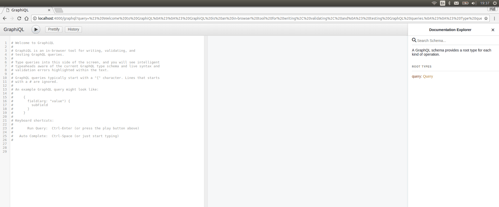

# Graphql Product Service Resource

I was interested to investigate graphql as I have noticed the difficulty with REST APIs that tend to be incomplete and inconsistent.

Graphql turned out to be slightly different from what I expected but does offer a compelling mechanism to deliver documented, complete , validate and multi-utility API services with minimal overhead.

## The example

The example domain I choose to create a sample for is a product-service-resource data set which represents a set of products which are delivered through a set of customer facing services which may have dependencies on other customerf facing services which ultimately are realized through resource facing services.

The data set is very simple.
```
// There are 3 products
var pss = [
  {id: 'ps1', name: 'Product Spec 1'},
  {id: 'ps2', name: 'Product Spec 2'},
  {id: 'ps3', name: 'Product Spec 3'}]

// There are 3 customer facing services
var cfss = [
  {id: 'cfs1', name: 'Customer Facing Service 1'},
  {id: 'cfs2', name: 'Customer Facing Service 2'},
  {id: 'cfs3', name: 'Customer Facing Service 3'}]

// There are 2 resource facing services
var rfss = [
  {id: 'rfs1', name: 'Resource Facing Service 1'},
  {id: 'rfs2', name: 'Resource Facing Service 2'}]

//The products depend upon cfs based on the following relationships
var pscfss = [
  {source: 'ps1', target: 'cfs1'},
  {source: 'ps2', target: 'cfs2'},
  {source: 'ps1', target: 'cfs3'}]

//The cfs depend upon rfs based on the following relationships
var cfsrfss = [
  {source: 'cfs1', target: 'rfs1'},
  {source: 'cfs2', target: 'rfs2'}]

//The one cfs depends on another.
var cfscfss = [ {source: 'cfs1', target: 'cfs2'}]
```

## The project structure

The implementation is in terms of 3 files

The data.js file has the data set above.
The schema.js declares the schema.
```
type Query {
    # query product specification by id
    productspecification(id: String): PS ,

    # query customer facing service specification by id
    customerfacingservicespecification(id: String): CFS,

    # query resource facing service specification by id
    resourcefacingservicespecification(id: String): RFS
}

# A product specification
type PS {
  # The id for the product specification
  id: String!,
  name: String!,
  customerfacingservicespecifications: [CFS]
}

type CFS {
  id: String!,
  name: String!,
  resourcefacingservicespecifications: [RFS],
  #The CFSs that depend upon this CFS
  dependencies: [CFS],
}

type RFS {
  id: String!,
  name: String!,
  dependencies: [RFS]
}
```

The implementation defines 4 classes , one for each of the types above.
The classes when constructed are passed the data set.

The index.js file defines an express app and installs the graphqp http server at the url path '/graphql'
```
var app = express();
app.use('/graphql', graphqlHTTP({
  schema: builtSchema,
  rootValue: imp.getRoot(),
  graphiql: true,
}));
app.listen(4000);
```

## The result

The result of this is the ability to query the data set using queries as per the demo.


